# Vistazo rápido

El presente repo contiene el código correspondiente al proyecto final de la materia [Minería de datos para texto](https://sites.google.com/unc.edu.ar/textmining2021/), a cargo de [Laura Alonso i Alemany](https://cs.famaf.unc.edu.ar/~laura/).

Objetivo del proyecto: Caracterizar discursos de odio dentro de la comunidad de [reddit Argentina](https://reddit.com/r/argentina). Esto es, detectarlos y encontrar sub-lenguajes de odio en los mismos.

Para realizar esto, se llevó a cabo un proceso consistente en 6 etapas, como se muestra en la siguiente figura:


Cada etapa tiene su correspondiente notebook:

1. Obtención del conjunto de comentarios de a través de la API de Reddit ([link](https://github.com/PerseoSoft/redditHateSpeech/blob/main/src/1_pipeline_download_reddit_comments.ipynb)).
   
2. Pre-procesamiento del mismo ([link](https://github.com/PerseoSoft/redditHateSpeech/blob/main/src/2_pipeline_preprocessing.ipynb)).

3. Aplicación de *embeddings* y categorización en *clusters* (*notebook* [LDA](https://github.com/PerseoSoft/redditHateSpeech/blob/main/src/3a_pipeline_lda.ipynb) [Word2vec](https://github.com/PerseoSoft/redditHateSpeech/blob/main/src/3b_pipeline_embedding_word2vec.ipynb) [fastText](https://github.com/PerseoSoft/redditHateSpeech/blob/main/src/3c_pipeline_embedding_fasttext.ipynb)).

4. Entrenamiento de un modelo de detección de odio y extracción de palabras de odio en cada *dataset* ([link](https://github.com/PerseoSoft/redditHateSpeech/blob/main/src/4_detect_hate_speech.ipynb)).
Para realizar el entrenamiento de los modelos, es necesario contar con los *datasets* respectivos de tres competencias (Hateval, DETOXIS, MeOffendMex) que se desee entrenar.

5. Uso del modelo para predecir los comentarios recolectados ([link](https://github.com/PerseoSoft/redditHateSpeech/blob/main/src/5_pipeline_hate_speech.ipynb)).

6. Combinación de dicho modelo con las categorías encontradas para encontrar correlaciones ([link](https://github.com/PerseoSoft/redditHateSpeech/blob/main/src/6_pipeline_result.ipynb)).


## Instalación

### Instalación con conda

Instalar Anaconda ([ver aquí](https://docs.anaconda.com/anaconda/install/index.html)) y luego ejecutar:

```bash
#Crear entorno con conda y activarlo
conda env create -f environment.yml
conda activate hateSpeech
#Descarga del Trained pipelines de spaCy
python -m spacy download es_core_news_lg
#Correr Jupyter Lab
jupyter lab --ip=0.0.0.0 --no-browser --allow-root --NotebookApp.token='' --NotebookApp.password=''
```
Ir a [http://localhost:8888](http://localhost:8888) para acceder a la UI de Jupyter.

### Instalación con Docker Compose

Instalar Docker Compose ([ver aquí](https://docs.docker.com/compose/install/)) y luego ejecutar:

```bash
#Construir imagen
docker-compose build
#Correr Jupyter Lab
docker-compose up -d
```

Ir a [http://localhost:8888](http://localhost:8888) para acceder a la UI de Jupyter.

## Flujo de datos generados

Los distintos notebooks forman un pipeline en el cuál cada uno utiliza los datos generados por el anterior. Se listan cada una de las entradas:

1. Obtención de comentarios. 
    - Archivos de entrada: N/A. 
    - Archivo de salida: *docs/reddit_data.csv*: CSV que contiene los comentarios de reddit descargados

2. Pre-procesamiento del dataset.
    - Archivos de entrada: *docs/reddit_data.csv*.
    - Archivos de salida: *docs/preprocessing_reddit_data.csv*: CSV con los comentarios pre-procesados.
   

3. Embeddings y clustering.
    - Archivos de entrada: *docs/preprocessing_reddit_data.csv*.
    - Archivos de salida: 
      - *docs/reddit_data_METODO.csv*, donde *METODO* puede ser 'lda', o 'word2vec', 'fasttext'. Cada uno de estos archivos toma el dataset pre-procesado y le agrega el número de clúster al que pertenecería cada comentario, según su cercanía.
      - *docs/models/MODEL.model*, el modelo entrenado. Puede ser 'word2vec', o 'fasttext'. 
      - *docs/models/MODEL_kmeans.model*, el modelo de k-means entrenado usando los embeddings de *MODEL* (para 'word2vec' y 'fasttext').

    
4. Entrenamiento y selección del modelo.
   - Archivos de entrada: *docs/hateval2019/hateval2019_es_train.csv*, *docs/detoxis_data/train.csv*, y *docs/MeOffendEs/mx-train-data-non-contextual.csv*. Estos archivos requieren la descarga previa manual de cada dataset.
   - Archivos de salida: para cada dataset, se guarda:
     - Palabras de odio de cada modelo: *docs/palabras_odio.csv*.
     - Vectorizador: *docs/models/DATASET_vectorizer.pkl* donde *DATASET* es hateval, detoxis, o meoffendmex.
     - Modelo entrenado: *docs/models/DATASET_INICIALES_MODELO_model.pkl* donde *INICIALES_MODELO* es 'lr', 'rf', o 'nb'.
   - Archivos de salida (de prueba): Predicciones: *docs/test/reddit_DATASET_hate_comments.csv*, uno para cada *DATASET*: 'hateval', 'detoxis', 'meoffendmex'.
   
5. Aplicación del modelo en comentarios de reddit. 
   - Archivos de entrada: *docs/reddit_data_METODO.csv*.
   - Archivos de salida:
     - *docs/reddit_data_hate_speech_METODO.csv* - CSV que categoriza cada uno de los comentarios como de odio/no odio.
6. Análisis de resultados.
   - Archivos de entrada: 
     * *docs/reddit_data_hate_speech_METODO.csv*
     * *docs/palabras_odio.csv*
   - Archivos de Salida: N/A. 

---

# Informe del proyecto

Se muestra a continuación el informe producto de este proyecto, en donde se especifican la motivación y objetivos del trabajo, y los distintos enfoques abordados para realizar la detección de odio.

Índice

- [Vistazo rápido](#vistazo-rápido)
  - [Instalación](#instalación)
    - [Instalación con conda](#instalación-con-conda)
    - [Instalación con Docker Compose](#instalación-con-docker-compose)
  - [Flujo de datos generados](#flujo-de-datos-generados)
- [Informe del proyecto](#informe-del-proyecto)
  - [Introducción](#introducción)
    - [Discursos de odio](#discursos-de-odio)
    - [Motivación del trabajo](#motivación-del-trabajo)
    - [reddit](#reddit)
      - [¿Por qué r/argentina?](#por-qué-rargentina)
  - [Paso a paso del proyecto](#paso-a-paso-del-proyecto)
    - [1. Obtención de los datos](#1-obtención-de-los-datos)
    - [2. Pre-procesamiento](#2-pre-procesamiento)
    - [3. Representación de tópicos mediante embeddings](#3-representación-de-tópicos-mediante-embeddings)
      - [3a. Embeddings con LDA](#3a-embeddings-con-lda)
    - [3b. Embeddings con Word2vec](#3b-embeddings-con-word2vec)
    - [3c. Embeddings con fastText](#3c-embeddings-con-fasttext)
  - [4. Entrenamiento de detectores de odio](#4-entrenamiento-de-detectores-de-odio)
  - [5. Aplicación del modelo a los comentarios de reddit](#5-aplicación-del-modelo-a-los-comentarios-de-reddit)
  - [6. Análisis de resultados](#6-análisis-de-resultados)
    - [6.1. Vista general de los distintos clusters](#61-vista-general-de-los-distintos-clusters)
    - [6.2. Vista de los clusters con mayor proporción de predicción positiva](#62-vista-de-los-clusters-con-mayor-proporción-de-predicción-positiva)
    - [6.3. Detección de clústers según palabras asociadas con odio](#63-detección-de-clústers-según-palabras-asociadas-con-odio)
    - [6.4. Análisis cercano de dos clústers](#64-análisis-cercano-de-dos-clústers)
      - [Cluster de Género](#cluster-de-género)
      - [Cluster de Soberanía](#cluster-de-soberanía)
    - [6.5. Visualización de términos cercanos seleccionados](#65-visualización-de-términos-cercanos-seleccionados)
  - [Conclusiones](#conclusiones)
  - [Trabajo futuro](#trabajo-futuro)
    - [General](#general)
    - [Clustering](#clustering)
    - [Modelo](#modelo)
    - [Información de contexto](#información-de-contexto)
  - [Fuentes consultadas para el trabajo](#fuentes-consultadas-para-el-trabajo)
    - [Discursos de odio](#discursos-de-odio-1)
    - [reddit API](#reddit-api)
    - [Procesamiento de lenguaje natural](#procesamiento-de-lenguaje-natural)
    - [Clustering](#clustering-1)
    - [Competencias](#competencias)
    - [Trabajos relacionados](#trabajos-relacionados)


## Introducción

### Discursos de odio

El discurso de odio es un problema muy relevante en la actualidad, dado su rol en la discriminación de grupos y minorías sociales, y [es considerado como precursor de crímenes de odio](https://www.rightsforpeace.org/hate-speech) [que incluyen al genocidio](https://scholarcommons.usf.edu/gsp/vol7/iss1/4).

Hay varias posturas sobre lo que es el discurso de odio, en general se coincide en que es un discurso que:

1. Apunta contra un grupo o individuo, basado en algún aspecto como su orientación sexual, religión, nacionalidad, etc.
2. Busca humillar, discriminar o propagar el odio/hostilidad/intolerancia hacia ese grupo.
3. Tiene una intención deliberada.

Su manifestación en Internet, además:

1. Puede motivar formas de agresión en línea.
2. Permite propagar el discurso de odio con velocidad.
3. Permite que el discurso se mantenga y comparta con facilidad.
4. Facilita la generación de cámaras de eco.
5. Al estar en servidores privados, la aplicación de la ley no siempre es rápida, lo que hace que ciertos actores intenten eludir su control, utilizando el discurso de odio en beneficio de su agenda.

A raíz de la gravedad que significa el problema, muchas plataformas sociales han reconocido el problema, tomando acciones para mitigarlo ([ver ejemplo](https://www.theguardian.com/technology/2016/may/31/facebook-youtube-twitter-microsoft-eu-hate-speech-code)),  prohibiendolo en sus términos de uso, pudiendo sus usuarios reportar comentarios que potencialmente contengan este tipo de discursos.
No obstante, a pesar de las prohibiciones y esfuerzos, que hasta llegan a incluir algoritmos de detección automática de discursos de odio en plataformas como Facebook e Instagram, el problema de la propagación de odio en redes sociales persiste, y genera daño, tanto a individuos como a comunidades.


### Motivación del trabajo

Considerando las consecuencias que pueden traer aparejadas los discursos de odio, este trabajo se enfoca en la detección de tales discursos en una comunidad particular de reddit. Los objetivos del mismo son: **1)** detección de comentarios con discurso de odio y **2)** caracterizar ese discurso de odio en sub-lenguajes de odio.

El presente trabajo se basa en la siguiente hipótesis: *"en una comunidad en donde existen comentarios con discurso de odio, es beneficioso combinar técnicas de aprendizaje supervisado y no supervisado, para realizar la detección de subcomunidades de odio, a partir de modelos que se especializan en distintos grupos de comentarios"*.

### reddit

[Reddit](https://www.reddit.com/) es una red social de “comunidades”, creadas y moderadas por sus propios usuarios. En cada comunidad, sus miembros hacen *posts*, y cada *post* puede ser comentado generando debate. Su aspecto distintivo es que cada *post* o comentario recibe votos, con el objetivo de que aquellos *posts* o comentarios que más aportan aparezcan encima de los que no. También se pueden premiar a aquellos destacados. 

En la siguiente imagen podemos ver la estructura general de un *post* en reddit (de r/argentina):


En este proyecto, nos centramos en [r/argentina](https://www.reddit.com/r/argentina/), que es una comunidad dedicada a charlar temas referentes a Argentina, que incluyen comidas, costumbres, chistes, deporte, política,  economía, consejos, entre otros.

#### ¿Por qué r/argentina?

Quisimos hacer nuestro trabajo enfocado en una comunidad Argentina fuera de las redes sociales más comunes (dado que son aquellas más frecuentemente estudiadas), pero que a la vez tenga el tamaño suficiente como para tener muchos usuarios e interacciones. En ese sentido, r/argentina fue la opción más prominente, ya que la comunidad es muy activa y cuenta con cerca de 350.000 suscriptores (a Noviembre de 2021).

Respecto a su posición frente a discursos de odio, en las reglas de r/argentina (en concreto, la Regla 3) se deja totalmente de manifiesto su prohibición. Citando textualmente:

>**3. No se permite el racismo, xenofobia u otras expresiones de odio**
>
> No se permite el racismo, xenofobia, ni ninguna otra forma de odio (incluyendo sexismo, homofobia, transfobia, clase social, etc), ni ningún tipo de discriminación o expresiones de odio o lenguaje deshumanizante en general; esto incluye comentarios incitando violencia. Esto también se extiende a grupos. Hacer referencia a enfermedades o discapacidades para insultar a otros no será tolerado. Usuarios que incurran en estas faltas podrán ser baneados permanentemente sin apelación.


No obstante, al elaborar este trabajo, hemos detectado casos de comentarios con discursos de odio, ej.: manifestando [aporofobia](https://es.wikipedia.org/wiki/Aporofobia), [obesofobia](https://es.wikipedia.org/wiki/Obesofobia), o comentarios agresivos contra mujeres, entre otros.

Dada esta situación, la motivación de nuestro trabajo es la de poder detectar automáticamente este tipo de comentarios, pudiendo caracterizar los mismos en sub-comunidades.


## Paso a paso del proyecto

Se describe a continuación, el paso a paso de las distintas etapas de este proyecto, partiendo de los datos iniciales, cómo los mismos fueron procesados y usados para entrenar distintos algoritmos, los resultados obtenidos tras ello, y finalmente las conclusiones y trabajo futuro.


### 1. Obtención de los datos

[Notebook](/src/1_pipeline_download_reddit_comments.ipynb)

Para la obtención de los datos se utilizó un *wrapper* de la API de reddit, llamado [PRAW](https://praw.readthedocs.io/en/stable/index.html), a partir del cual se descargaron comentarios de diferentes *post* del r/argentina, así como las respuestas de los comentarios.
Los *posts* en reddit pueden ser de tipo *link* (por ejemplo, colocando el *link* hacia una noticia), o pueden ser de tipo texto.
Para la descarga de comentarios de cada *post*, se consideraron sólo aquellos que contenían texto, y una cierta cantidad de caracteres como mínimo.

De cada comentario que se guardó de reddit, se obtuvieron los siguientes datos:
- **id**: identificador del *post* o comentario. Guardado por cuestiones de trazabilidad.
- **comment_parent_id**: identificador del comentario al cuál responde el comentario actual, en caso que corresponda. Se guardó por cuestiones de trazabilidad.
- **flair**: categoría del *post*, asignada por el usuario que lo crea (a partir de una lista brindada por el propio subreddit). En el caso de r/argentina, las categorías incluyen tópicos como "Política", "Economía", "Humor", "Historia" o "Serio".
- **comms_num**: número de respuestas que recibió el comentario.
- **score**: es un puntaje que los usuarios le dieron al comentario.

En total, se descargaron 27791 comentarios desde el día 08/10/2021 hasta el 19/10/2021.


### 2. Pre-procesamiento

[Notebook](/src/2_pipeline_preprocessing.ipynb)

Teniendo descargados los datos, se aplicó un pre-procesamiento sobre cada comentario, que consistió en:

- Eliminar emojis, urls, comillas, caracteres especiales y puntuaciones.
- Aplicar tokenización, dividiendo cada comentario en sus correspondientes palabras.
- Conversión a minúscula.
- Eliminación de *stopwords* (mediante spaCy).
- Lematización (mediante spaCy).
- Construir bigramas y trigramas.

### 3. Representación de tópicos mediante *embeddings*

Teniendo los comentarios pre-procesados, el siguiente objetivo fue detectar tópicos a partir de los mismos de acuerdo a las co-ocurrencias de las palabras, para poder identificar los distintos temas que se hablan, y los sublenguajes empleados en ellos.

Para poder llevar esto a cabo, se emplearon tres métodos en los datos obtenidos:

1. Latent Dirichlet Allocation.
2. Word2vec.
3. fastText.

Se describe a continuación cada uno de ellos, mostrando particularmente algunos comentarios que fueron agrupados a través de las diferentes técnicas aplicadas. 
Analizamos un evento particular que se encuentra presente en los tres métodos, y se capturó durante la descarga de estos datos.
Este evento fue el debate de la "[Ley de Promoción de la Alimentación Saludable](https://www.boletinoficial.gob.ar/detalleAviso/primera/252728/20211112)", también conocida como "ley de etiquetado frontal".
Vamos a comparar las subcomunidades obtenidas en cada técnica, analizando particularmente aquéllas referidas a este evento.


#### 3a. *Embeddings* con LDA

[Notebook](/src/3a_pipeline_lda.ipynb)

El primer modelo que se comenzó utilizando es [Latent Dirichlet Allocation](https://en.wikipedia.org/wiki/Latent_Dirichlet_allocation), que es un método generativo que asume que cada documento está compuesto por una mezcla de tópicos, y donde cada palabra tiene una probabilidad de relacionarse con cada uno de ellos.
La elección inicial de LDA se fundamentó en que es un método sólido para detección de tópicos en *corpus* de texto.

El modelo se aplicó probando tamaños de *clústers* de 30 a 120, y distintas configuraciones de híper-parámetros. No obstante, los resultados obtenidos  no fueron satisfactorios, ya que a la hora de realizar un análisis de los tópicos identificados por el modelo, se encontró poca cohesión entre los tópicos detectados.

En la siguiente imagen se pueden observar algunos de los tópicos identificados por LDA.


El tópico número 91, **piedra - etiqueta - pan - mira**, incluye comentarios sobre la tratativa de la ley de etiquetado y temas que tienen que ver con la comida en general. Algunos comentarios son:

1. "Me alegro mucho, seguro muy feliz todos por el reencuentro. Igual te recomiendo que no coma directo de la lata, pasale a un platito o comedero. Entiendo que a veces ni te dan tiempo."
2. "Todo mi secundario el desayuno fue un fantoche triple y una lata de coca.  Y sólo gastaba 2. Qué buenos tiempos."
3. "La manteca no hace mal. Es muy difícil comer exceso de grasas para tu cuerpo en comparación con lo fácil que es atiborrarte con azúcar y carbohidratos. Esos son los verdaderos enemigos"
4. "Y con etiquetas que te dicen cuánta grasa tiene un kilo de bayonesa"
5. "Alta banfest se van a mandar los mods con este thread. Despedite de tu cuenta, maquinola, denunciado"


### 3b. *Embeddings* con Word2vec

[Notebook](/src/3b_pipeline_embedding_word2vec.ipynb)

Dado que el funcionamiento con LDA no se consideró como satisfactorio, el siguiente paso consistió probar otro tipo de modelos: los *embeddings* de palabras.
Los mismos consisten en llevar las palabras a un nuevo espacio, de forma tal que aquellas que comparten un contexto común en los comentarios obtenidos, tiendan a encontrarse mucho más cerca que aquellas que no.
De esta manera, se podrían identificar subcomunidades en este nuevo espacio.

Para ello, se llevaron a cabo los siguientes pasos:

1. Entrenar el modelo de generación de *embeddings* de palabras mediante una **tarea de pretexto** (dada una palabra, predecir información relacionada a su contexto, por ejemplo una palabra que le sigue). Se emplearon dos modelos: [Word2vec](https://en.wikipedia.org/wiki/Word2vec), cuyos resultados se muestran en esta sección, y [fastText](https://en.wikipedia.org/wiki/fastText), mostrado en la siguiente.
2. Una vez entrenados los modelos, se procedió a generar una representación vectorial de cada comentario, donde cada uno se mapeó a un vector numérico de acuerdo al promedio de los *embeddings* de cada una de sus palabras.
3. Se aplicó el algoritmo de *clustering* *[k-means](https://en.wikipedia.org/wiki/K-means_clustering)*, tomando los vectores generados en el paso anterior.

Tras realizar el entrenamiento y aplicar *clustering*, se observó que los tópicos obtenidos se identificaban de forma mucho mejor que al usar LDA.
Estos tópicos, además se identificaron mejor con un número alto de *clusters* (120), frente a un número menor (como 30 o 70).
En la siguiente imagen se pueden observar algunas de las subcomunidades identificadas tras aplicar Word2vec.


En particular, el *cluster* número 94, **ley - etiquetado - proyecto**, es el que incluye comentarios sobre la tratativa de la ley de etiquetado y temas que tienen que ver con las leyes en general. Algunos comentarios del mismo son:

1. "Una prueba mas de la ley de oferta y demanda"
2. "Con la nueva ley no le podés regalar leche entera o un alfajor a un comedor, decir comida basura en un país donde el 50\% de los chicos no hacen toda las comidas es lo más clasista que existe."
3. "Recuerden la ley de alquileres.... Fué sancionada con un beso muy fuerte de los K, PRO y demás muchachos..."
4. "No entiendo cómo hay tanta gente en contra de una ley que no te cambia un carajo tu vida. Es la ley más anodina que sacó el Kirchnerismo en toda su historia creo"
5. "Pero hay leyes contra la violencia de genero! Como paso esto!!!1!?"
6. "No existe tal cosa en Argentina. Existe el Estado de Sitio, pero no se asemeja para nada a una ley marcial.. El concepto de ley marcial como tal, desapareció en el 94 con la nueva Constitución."

### 3c. *Embeddings* con fastText

[Notebook](/src/3c_pipeline_embedding_fasttext.ipynb)

Finalmente, el último método aplicado fue [fastText](https://en.wikipedia.org/wiki/fastText) que entrena una tarea de pretexto para generar un *embedding* de palabras al igual que Word2vec, pero además tiene en cuenta las sub-palabras, lo cuál resulta útil para identificar las alteraciones que puede tener una misma palabra.

En la siguiente imagen se pueden observar algunas de las subcomunidades identificadas por fastText.


Como se puede ver en el cluster **jaja - jajaja - jajajar - jajajaja - jajaj**, fastText identifica mejor las alteraciones que pueden suceder dentro de una palabra.

El *cluster* número 113, **ley - etiquetado - votar**, incluye comentarios sobre la tratativa de la ley de etiquetado y temas que tienen que ver con las leyes en general. Algunos comentarios son:

1. "Feriado con fines turísticos. Ley 27.399"
2. "ajajaja como los cagaron a los primeros. como siempre la ley aplica a todos por igual /s"
3. "El sticker en Chile fue durante la transición de la ley. Imagínate tener productos fabricados y tener que cambiar la envoltura a todos para que cumplan la ley"
4. "Gracias gloriosa ley de regulación de alimentos, ahora se que desayunar coca cola con surtidos bagleys esta mal"
5. "Eso y que la ley va a prohibir vender dulces y gaseosas en los colegios, y usar imágenes de famosos en los envases."
6. "Eso está por la ley Micaela no?. Tipo esta clase de capacitaciones no?"
7. "y ahora Lipovetzky reconoce lo de la ley de alquileres"

Si bien existen algunos *clusters* que nos permiten identificar tópicos específicos (como el 113), se observó que si bien el método detecta variantes de palabras, en términos generales los *clusters* no se traducen en tópicos cohesivos. Por ejemplo, en el *cluster* número 54 encontramos comentarios de diferentes tópicos:
1. "No lo veo a Belgrano? Saavedra?. Me re mintieron!"
2. "Mate de cafe re copado, un litro de cafe en tu organismo"
3. "ajajajajajaj Geologia, es re linda carrera igual pero esta materia es una completa mierda"
4. "cuando dije eso? milei está re bajon desde el debate del otro dia, me lo dice gente que habla con el casi todos los dias"

También se observó que algunos *clusters* se construyen exclusivamente alrededor de una palabra y sus variantes, por ejemplo el 43 se construyó alrededor de la palabra **decir**:

1. "Por eso dije ""en general"". Hay excepciones."
2. "Son los muy menos. Yo diría que 1 de cada 100."
3. "6! Seis! Seis, por favor! Dije seissss??!!"
4. "sera lo que el gobierno diga"
5. "Lo sé lo sé... Me lo decía mi abuela"

Observando esto, y el buen rendimiento obtenido al usar Word2vec, se optó finalmente por avanzar en la identificación de subcomunidades empleando dicha técnica.


## 4. Entrenamiento de detectores de odio

[Notebook](/src/4_detect_hate_speech.ipynb)


En paralelo a la búsqueda de *clusters* que agrupan los distintos tópicos, se buscó también, a partir de los datos [pre-procesados anteriormente](#2-pre-procesamiento), el detectar automáticamente comentarios de odio, para poder combinarlos con los [tópicos encontrados](#3-embeddings). Para ello, se recurrió a conjuntos de datos anotados y en castellano, que hayan sido utilizados para tareas similares. En particular, se optó por los siguientes tres:


1. HatEval: *dataset* con cerca de 7000 *tweets* de usuarios de España, que potencialmente manifiestan discurso de odio contra mujeres o inmigrantes. Este *dataset* es el más parecido a la tarea que queremos resolver, ya que tiene datos etiquetados que marcan directamente si se trata o no de un *tweet* con discurso de odio, sea contra un individuo o un grupo.

2. DETOXIS: *dataset* con cerca de 3500 comentarios de sitios de noticias/foros españoles, que posiblemente contienen toxicidad. Si bien un mensaje con toxicidad no es necesariamente discurso de odio (y un mensaje con discurso de odio puede tener toxicidad o no), suele estar asociado al mismo.

3. MeOffendMex: *dataset* con alrededor de 5000 *tweets* de usuarios de México, que posiblemente contienen mensajes ofensivos. Al igual que la toxicidad, un mensaje ofensivo no necesariamente está manifestando odio, pero suelen estar asociados. 

En cada uno de los mismos, se entrenaron tres modelos de aprendizaje supervisado: *[regresión logística](https://en.wikipedia.org/wiki/Logistic_regression)*, *[naive Bayes](https://en.wikipedia.org/wiki/Naive_Bayes_classifier)* y *[random forest](https://en.wikipedia.org/wiki/Random_forests)*, todos provistos por la librería [scikit-learn](https://scikit-learn.org).


Para realizar el entrenamiento, a cada comentario se le aplicó el vectorizador [CountVectorizer](https://scikit-learn.org/stable/modules/generated/sklearn.feature_extraction.text.CountVectorizer.html), que transformó cada comentario en una matriz *sparse*, donde cada fila representa un comentario, y cada columna incluye las distintas palabras (unigramas) o combinaciones de dos o tres palabras (bigramas y trigramas).

Tal matriz, junto con las correspondientes etiquetas de cada comentario, constituyeron la entrada de cada uno de los modelos. Tales modelos funcionaron bastante bien con sus configuraciones básicas, mostrando matrices de confusión sólidas en los conjuntos de validación, para las tareas para los que fueron entrenados.
La siguiente tabla muestra un vistazo rápido de los resultados obtenidos, al evaluar el rendimiento de los modelos en el conjunto de validación.

| Modelo              | Dataset     | Tasa de aciertos | F1 clase 0 | F1 clase 1 |
|---------------------|-------------|:-----------------:|:----------:|:----------:|
| Regresión logística | Hateval     |        .8        |     .84    |     .76    |
| Naive Bayes         |             |        .8        |     .84    |     .75    |
| Random forest       |             |        .77       |     .79    |     .74    |
| Regresión logística | DETOXIS     |        .96       |     .98    |     .09    |
| Naive Bayes         |             |        .86       |     .92    |     .11    |
| Random forest       |             |        .96       |     .98    |     .00    |
| Regresión logística | MeOffendMex |        .77       |     .85    |     .53    |
| Naive Bayes         |             |        .76       |     .82    |     .62    |
| Random forest       |             |        .79       |     .87    |     .53    |

Una vez teniendo los modelos entrenados, se extrajeron las palabras que más probablemente manifiesten odio en cada *dataset*, de acuerdo a su aporte a la clasificación de las palabras. Estas palabras fueron guardadas en el archivo [palabras_odio.csv](src/docs/palabras_odio.csv).
Por otra parte, [se guardaron](src/docs/models/) los modelos entrenados en cada *dataset*, y sus correspondientes vectorizaciones para su uso posterior.


## 5. Aplicación del modelo a los comentarios de reddit

[Notebook](/src/5_pipeline_hate_speech.ipynb)

Teniendo los modelos entrenados en tres *datasets* con tareas similares, el siguiente paso consistió en aplicarlos en los comentarios recolectados y [preprocesados previamente](#2-pre-procesamiento), para evaluar cómo los mismos se desenvuelven, viendo algunos de los comentarios que fueron predichos como positivos.
Lo primero que se observó al verlos fue la significativa cantidad de falsos positivos (con el umbral de clasificación por defecto de 50\%), prediciendo como verdaderos a comentarios totalmente inofensivos.

A raíz de ello, se optó por incrementar los umbrales de clasificación de los modelos en pos de reducir los falsos positivos. En la siguiente tabla se observa cómo varía la cantidad de comentarios clasificados como positivos de acuerdo al umbral de clasificación, de los 27791 comentarios recolectados en total.

| Modelo              | Dataset     | # pred. umb. 0.5 | # pred. umb. 0.6 | # pred. umb. 0.7 | # pred. umb. 0.8 | # pred. umb. 0.9 |
|---------------------|-------------|:----------------:|:----------------:|:----------------:|:----------------:|:----------------:|
| Regresión logística | HatEval     |       5344       |       3151       |       1710       |        790       |        227       |
| Naive Bayes         | HatEval     |       10420      |       6951       |       4312       |       2370       |        948       |
| Random forest       | HatEval     |       1336       |        338       |        52        |         3        |         0        |
| Regresión logística | DETOXIS     |        19        |         7        |         2        |         0        |         0        |
| Naive Bayes         | DETOXIS     |       3695       |       2393       |       1618       |       1003       |        512       |
| Random forest       | DETOXIS     |         0        |         0        |         0        |         0        |         0        |
| Regresión logística | MeOffendMex |       1197       |        679       |        367       |        166       |        50        |
| Naive Bayes         | MeOffendMex |       7977       |       5247       |       3502       |       2075       |       1080       |
| Random forest       | MeOffendMex |        455       |        167       |        72        |        14        |         0        |


De la misma, se ve que naive Bayes es el modelo que mayor cantidad de comentarios clasifica como positivo. Por ejemplo, en HatEval, empleando un umbral de 0.5, clasifica un 37\% del total de comentarios como de odio. A este modelo le siguen la regresión logística y random forest, que tiende a clasificar muy poca cantidad de ejemplos como positivo al aumentar el umbral desde 0.6 (llegando a no clasificar ningún ejemplo como positivo en el dataset DETOXIS).

Por otra parte, se observó también (en un vistazo general de las predicciones) que el *dataset* con el mejor rendimiento en la detección fue MeOffendMex. Tenemos la conjetura de que esto se debe a que el lenguaje que de los comentarios de este *dataset* es el más parecido al utilizado en r/argentina.


## 6. Análisis de resultados

[Notebook](/src/6_pipeline_result.ipynb)

En la siguiente sección, se toman los [*clusters* generados](#3-representación-de-tópicos-mediante-embeddings), los [modelos entrenados](#4-entrenamiento-del-detector-de-odio) y [sus predicciones](#5-aplicación-del-modelo-a-los-comentarios-de-reddit), para llevar a cabo un análisis de los resultados obtenidos.

Para este análisis, se usó el modelo Naive Bayes (con un umbral de clasificación de 0.8) entrenado sobre el conjunto de datos MeOffendMex, y el modelo Word2vec entrenado previamente.
Como en MeOffendMex cada comentario se etiqueta según si representa una ofensa/agresión (y no necesariamente si es discurso de odio), consideramos a cada comentario como "positivo" si el mismo contiene una agresión o discurso de odio, y como "negativo" en caso contrario.
La razón de este criterio es que en los datos observados, la mayoría de veces un comentario con discurso de odio incluye también una agresión, y aunque no sucede lo mismo a la inversa, consideramos que es un buen punto de partida para abordarlo desde este trabajo.

### 6.1. Vista general de los distintos clusters

Vemos una vista general de los datos con los que se cuenta hasta ahora, con respecto a su distribución en los distintos *clusters*.

* Se cuenta con 27.791 comentarios, donde cada uno tiene asignado un número de tópico y una etiqueta indicando si el clasificador lo categorizó como discurso de odio / agresivo o no. Los mensajes se distribuyen en los tópicos de la siguiente manera:

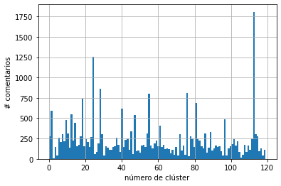

* En muchos de los clusters se identifican tópicos concretos. Algunos ejemplos:
  * *Cluster* 8: economía.
  * *Cluster* 18: política.
  * *Cluster* 23: dólar.
  * *Cluster* 94: leyes.
  * *Cluster* 98: comidas.
  * *Cluster* 99: género.
  * *Cluster* 116: insultos.

* De los 27.791 comentarios, 2075 fueron predichos como de odio por el clasificador seleccionado. Tales predicciones se distribuyen como sigue:

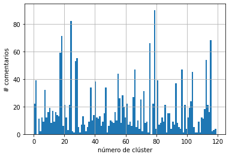

* De los distintos *clusters*, existen varios cuyo porcentaje de comentarios predicho como odio es muy significativo:

| Número de cluster | \% pred. positivas |
|:-----------------:|:-----------------------:|
|        116        |           73\%          |
|         66        |           39\%          |
|         79        |           36\%          |
|         27        |           27\%          |
|         93        |           24\%          |


* Vemos también el porcentaje de comentarios predichos en cada *flair*:

|     Flair    | \% pred. positivas |
|:------------:|:-----------------------:|
|  Historia🇦🇷  |         11\%        |
|  Policiales🚨 |         10\%        |
|   Política🏛️  |         9\%        |
|   Meet-up❗   |         9\%        |
|    Video📽️    |         9\%        |


* Vemos, para todos los *clusters* en general y para los tres de mayor proporción de predicciones en particular, si existe una correlación lineal tanto entre el puntaje y la cantidad de réplicas de cada comentario, y su predicción como mensaje de odio.

| Cluster | Corr. puntaje y pred. pos. | Corr. num. com. y pred. pos. |
|:-------:|:--------------------------:|:----------------------------:|
|  Todos  |          -0.001         |           -0.016          |
|   116   |          0.028          |           0.005           |
|    66   |          0.068          |           0.170           |
|    79   |          -0.025          |           -0.150          |

Al ver todos los *clusters*, se observa que no existe una correlación lineal entre el puntaje o cantidad de comentarios obtenidos, y clasificación o no como discurso de odio. Por otra parte, al ver esto en los tres *clusters* donde se detectó una mayor proporción de discurso de odio, se observa que la correlación varía levemente según el caso, no habiendo encontrado un patrón en esta variación.


### 6.2. Vista de los *clusters* con mayor proporción de predicción positiva

Vemos los términos más cercanos a los centroides de cada uno de los tres *clusters* con más proporción de predicciones positivas (el 116, 66 y 79):

* *Cluster* 116: "hijo puta kjjjjjjjjjjj palmó comper pobretonto pario colaborá ramen vigote "
* *Cluster* 66: "va coquetar orina desmechado ansiosa amigoooo catre vas guita safás "
* *Cluster* 79: "kjjjjjjjjjjj hijo palmó comper pobretonto ahorcandolo pario puta ramen refuta "

Vemos ahora las palabras de mayor frecuencia (tanto predichas o no como odio), encontradas en los mismos.

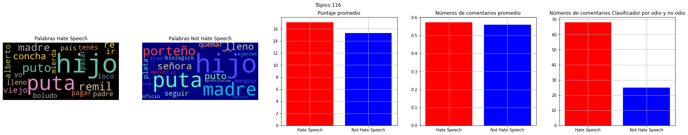
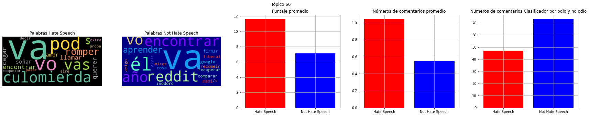
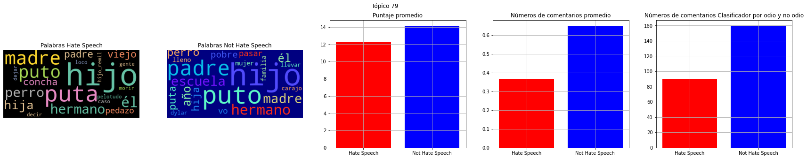

Puede observarse que se detectan muchos insultos en los tres *clusters*. No obstante, no se distingue una separación clara de los términos usados (tanto de odio como de no odio) al realizar agrupamiento por términos más frecuentes. Por ello, se optó por ordenarlos según su [información mutua puntual](https://es.wikipedia.org/wiki/Punto_de_informaci%C3%B3n_mutua) (PMI). Se muestra abajo como quedarían entonces los términos agrupados de esta forma, en donde se puede ver que el ordenamiento es mucho mejor:


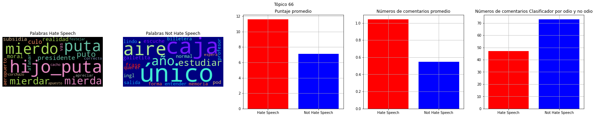
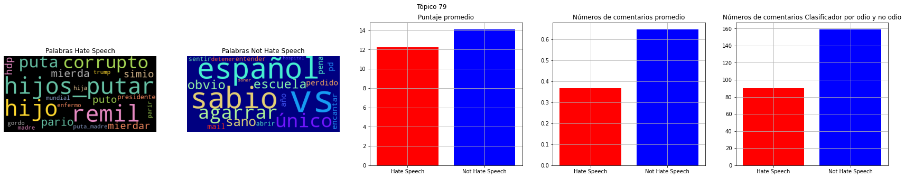

Otro aspecto que se observa es que el puntaje promedio y la cantidad de respuestas que se reciben en los dos primeros *clusters* es mayor si los comentarios fueron clasificados como de odio/agresión.

### 6.3. Detección de *clusters* según palabras asociadas con odio

Dadas las palabras asociadas con odio extraídas anteriormente de los modelos, se analiza si es posible encontrar nuevos *clusters* que tengan contenido de agresión u odio, en base a la distancia de cada una de las mismas con respecto a ellos.
Para ello, se obtienen los *clusters* más cercanos de cada una de dichas palabras, y se evalúa cuáles fueron los *clusters* que ocurrieron más frecuentemente al considerar todas las palabras.

El resultado se puede ver en la siguiente tabla:

| *Cluster* más frecuente (# en top 1) | *Cluster* más frecuente (# en top 3) |
|:----------------------------------:|:-------------------------------------------------:|
|            0 (72 veces)            |                    0 (72 veces)                   |
|              113 (10)              |                      87 (72)                      |
|               24 (4)               |                      86 (72)                      |
|               116 (4)              |                      113 (15)                     |
|               81 (1)               |                      24 (14)                      |

Vemos cuáles fueron los términos más comunes de cada *cluster* detectado. Respecto a los *clusters* que más se repitieron:

* *Cluster* 0: "hacer dislocar desuscribite ss vtv paja preferiría bosta oooon maloliente "
* *Cluster* 113: "ibarra baratisimo diz rayitar candadito feriar dolaaaar mote doxxeo gual "
* *Cluster* 24: "childrir changes clothes argument wage \-mr oooon boah pandemic ⣄ "

Respecto a los *clusters* que más aparecieron en entre los tres más cercanos (excluyendo el *cluster* 0):

* *Cluster* 87: "macri sander bowie ionizante acuario galperin descubierto peluco preferio freestyler "
* *Cluster* 86: "salir biodegradar tenian grabate navegar pensés esfuenzar chango platea drogar "
* *Cluster* 113: "ibarra baratisimo diz rayitar candadito feriar dolaaaar mote doxxeo gual "

Vemos los términos más frecuentes de varios de estos *clusters*:

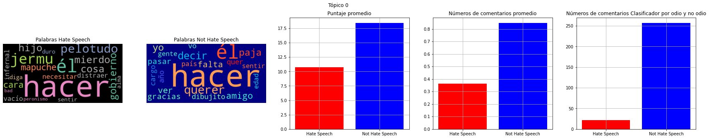
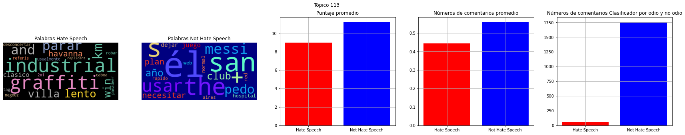
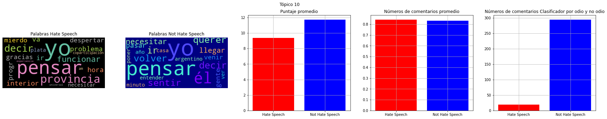


Al igual que como se observó en la sección anterior, el ordenamiento por frecuencia no muestra una separación clara entre las palabras de odio/agresión y las que no.

Vemos ahora los términos ordenados por información mutua puntual

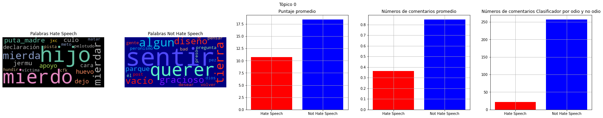
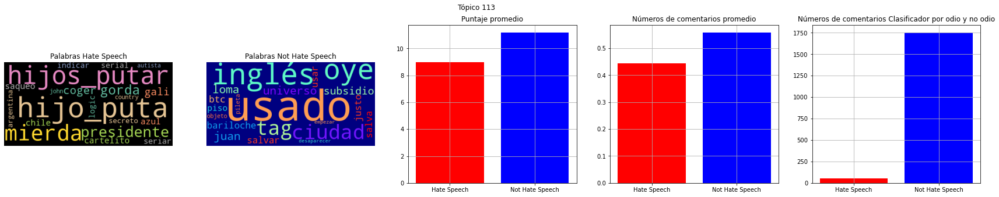
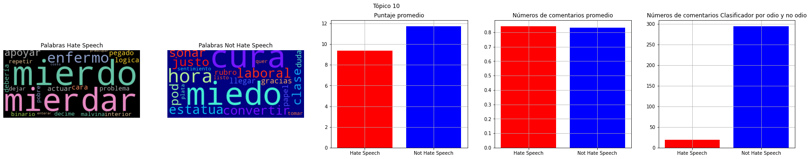

Vemos que las palabras se separan mejor; no obstante, se aprecia que las palabras de odio ordenadas según su PMI se parecen a las palabras encontradas al aplicar este mismo criterio en la sección anterior.

### 6.4. Análisis cercano de dos *clusters*

En particular, se seleccionaron dos *clusters* que nos resultaron de interés que no estaban categorizados según los dos criterios tomados en las secciones anteriores, los etiquetamos manualmente como de odio/agresivos, y evaluamos cuál es el rendimiento del modelo sobre los mismos.

Los *clusters* seleccionados fueron el de género (99) y el de soberanía (94). Para cada caso, se realizó un etiquetado a mano de cada comentario, respecto a si el mismo contenía discurso de odio y contenido agresivo. Esto se hizo con el fin de poder analizar la calidad de la detección del modelo en estos casos particulares.

A modo de aclaración, el etiquetado de ambos *clusters* se realizó según el criterio de quienes hicimos este trabajo; el mismo fue está sujeto a errores u omisiones. No obstante, consideramos que resulta muy importante para poder obtener una vista del rendimiento del modelo, y de sus puntos fuertes y débiles.

Los comentarios de estos *clusters* con etiquetado manual se encuentran en los siguientes documentos:

- [Análisis manual de cluster de género](/src/docs/analisis/genero.csv).
- [Análisis manual de cluster de soberanía](/src/docs/analisis/soberania.csv).

A continuación, vemos los resultados de las predicciones de cada *cluster*:

#### *Cluster* de Género

El *cluster* 99 contiene comentarios que hacen referencia a temas de género, tales como: "mujer, hombre, no binario, homosexual, trans", entre otros.

Vemos la distribución de las palabras del *cluster* según su frecuencia e información mutua:

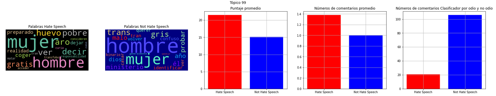

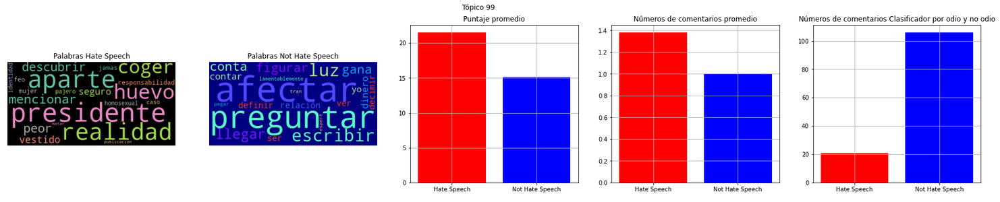

Varios aspectos a mencionar:
* El puntaje promedio es mayor cuando los comentarios se predicen como de odio/agresivos.
* Las nubes de palabras que ordenan los términos por frecuencia expresa mucho mejor los comentarios de este tópico que la que los ordena por información mutua.
* Además, en la nube de palabras clasificadas como de odio, las palabras que mayor PMI tienen son considerablemente distintas a las que se observaron en las secciones anteriores.

Vemos ahora la matriz de confusión del modelo al realizar predicciones en este *cluster*:


Como se puede observar, se cuenta con un conjunto de datos en donde la mayoría no son de odio (100, frente a 27), y se distribuyen de forma similar los errores, tanto la cantidad de falsos positivos como de falsos negativos.

Vemos algunos ejemplos de predicciones del modelo:

Predichos correctamente como discurso de odio / agresivos:

- "Vamos todos juntos!!: "*a La mUjEr sE le CrEe sieMpReEEe!!!*""
- "Seguro era un hombre vestido de mujer!!! las mujeres no hacen esas cosas, son seres de luz! jamas harian eso!!!"
- "Espert es lo mejor que hay, lamentablemente nunca va a llegar a ser presidente porque su mujer es fea.. A menos que se separe y establezca relación con una mujer más atractiva."
- "Pero los hombres son pajeros y lo hacen gratis. Conseguir hombres es casi gratis."


Predichos incorrectamente como discurso de odio / agresivos:

- "Es cierto que las cárceles de mujeres son mucho peores que las de los hombres?"
- "Pobre hombre. Pobre familia. Ni se lo vio venir ):"
- "Ajajja escribo re contra mal, pero es cierto que puede afectar a los hombres! Graciassss"
- "La pregunta para definir si ir es: aparte de lo que contas, había Mujeres?"


Predichos correctamente como no discurso de odio / agresivos:

- "Estás minimizando el sufrimiento de la mujer"
- "No binario quiere decir que no se identifica ni como mujer ni como hombre. Si se identifica como mujer entonces es binario."
- "Que el ministerio se llame "de mujeres y géneros" no es redundante?"
- "Uff siendo mujer debe ser mucho más jodido…"


Predichos incorrectamente como no discurso de odio / agresivos:

- "Recuerden chiques: si al crimen lo comete una mujer, lo justificamos como sea. MAL"
- "Hombre y mujer, el resto son diferentes gamas de homosexualidad"
- "Si un hombre siquiera está cerca dd una mujer sin su completa aprobación, es automáticamente violencia de género, machismo y patriarcado.. - alguna feminazi."
- "Eso prueba que las mujeres siempre estan cachondas."


#### *Cluster* de Soberanía

Este *cluster* (número 94) incluye comentarios que hacen referencia a diferentes tipos de soberanía, como la territorial. Dentro del tópico se ven comentarios referidos al conflicto por el territorio Mapuche, comentarios sobre las Islas Malvinas, la aprobación del Senado de la Nación de la Ley que establece el "Día Nacional del Kimchi", entre muchos otros.

Vemos la distribución de las palabras del *cluster* según su frecuencia e información mutua:

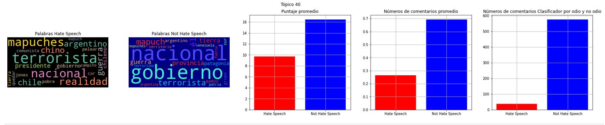


* El ordenamiento por frecuencia refleja mejor el tópico de soberanía que se habla, aunque el ordenamiento por PMI también muestra algunos aspectos del tópico.
* En este *cluster* en particular, la proporción de comentarios predichos como de odio por el modelo es muy baja; también se da que tanto el puntaje como la cantidad de comentarios recibidos es menor para aquellos comentarios predichos como de odio que aquellos que no.

Vemos la matriz de confusión del modelo en este *cluster*:

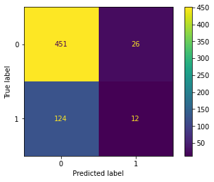

* Al igual que en el *cluster* de género, la proporción de comentarios cuya etiqueta es de odio o agresivo es mayor (477) a aquellos que no (136).
* No obstante, la cantidad de comentarios correctamente predichos como de odio es muy baja (12), y la mayoría de errores fueron, para nuestra sorpresa, falsos negativos (124, frente a 26 falsos positivos).
* Consideramos que esto se da porque muchos de los comentarios que consideramos como de odio al realizar el etiquetado manual, usan un lenguaje peyorativo sobre una minoría (los mapuches), lo cuál dista bastante de los términos usados en comentarios con los que el modelo fue entrenado (MeOffendMex).

Vemos ahora algunas predicciones en concreto: Comentarios predichos correctamente como discurso de odio o agresivos:

- "No, ni siquiera. Esperan que el Estado los proteja mediante DDDH. Esto esta apuntado en contra del "empresario usurpador capitalista" y la gente víctima de los ataques de estos insurgentes terroristas de mierda."
- "Madre de terroristas ofrece ayuda a terroristas.. Mas noticias, el pronostico y un par de culos luego de los comerciales."
- "Los chilenos ya tienen a los """mapuches"""" en sus calles prendiendo fuego todo y algunos se metieron al congreso, dudo que puedan o tengan la intencion de hacer algo."
- "y de paso hacerte unos ntfs con la cara del mapuche flogger mártir preso en chile para recaudar unos dólarcitos más"


Predichos incorrectamente como discurso de odio o agresivos:

- "Lo de China no le perdono, porque siguiendo su logica no deberiamos ni estar negociando con EEUU por su "Moral". En los negocios internacionales no hay moral solo utilitarismo"
- "oh Rallo eres un tesoro nacional"
- "Igual eso no cambia la realidad del abandono de las islas y el descuido del pais"
- "Si es por tu cuenta no es natural"


Predichos correctamente como no discurso de odio / agresivos:

- "Ni en Corea tienen dia nacional del kimchi me parece"
- "Y Dolarizando te tenes que comer la impresión de billetes a lo argentina que está haciendo la reserva federal con este nuevo gobierno… sin ninguno de los “beneficios”."
- "Listo para ir a las Malvinas (?)"
- "Cerca de la Patagonia está la Antártida."


Predichos incorrectamente como no discurso de odio / agresivos:

- "Gracias por la info dia a dia! Es importante estar al corriente de los atentados de los terroristas mapuches!. HAGA PATRIA ..."
- "Hay que ajusticiar a todos los emo mapuches."
- "Reprimir no, a esta altura tiene que ser balas de plomo"
- "Aquí vemos a dos machos de la especie paquerus peronistus luchando por marcar territorio"


### 6.5. Visualización de términos cercanos seleccionados

Para la siguiente visualización, tomamos varias palabras vistas hasta aquí en cada uno de los *clusters*, obtenidas por frecuencia o información mutua, y otras que se han ido probando, y vemos dónde se situarían las mismas según su cercanía a cada *cluster*, y cuáles serían las palabras más cercanas a la misma en el espacio proyectado, tanto para Word2vec como de fastText.
La motivación detrás de este análisis es que pueden descubrirse palabras de odio/agresivas a partir de otras.

Vemos las palabras más cercanas a cada una de las distintas palabras en Word2vec, la distancia de cada una, y el *cluster* en el que serían clasificadas.

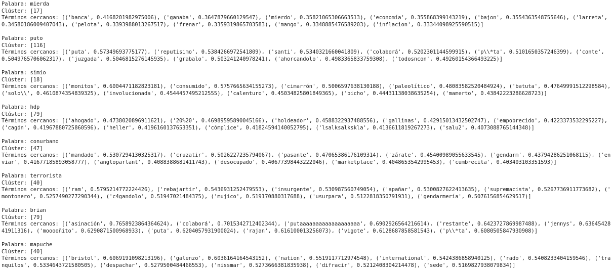

Vemos ahora las cercanías de las distintas palabras en fastText


Tras observar las palabras similares a cada una de las otras tanto con Word2vec como con fastText, puede verse que: 
* En Word2vec, en algunos casos se obtienen términos muy representantivos, sea por contener palabras con significado parecido, o por manifestar el contexto donde ocurren las palabras, mientras que en otros no se observa a simple vista una relación evidente. Una de las palabras que manifiesta su uso común en comentarios que suelen involucrar discursos de odio, es la palabra "Brian", donde se observa a través de sus términos relacionados, que ese nombre es usado de forma muy peyorativa, comúnmente en mensajes que contienen aporofobia.

* En fastText, se detectan mejor las mismas variantes de una misma palabra. Por ejemplo, "conurbano" se relaciona con la palabra peyorativa "congourbano" *[sic]* (usada en varios mensajes con discurso de odio), así como con "conurbanense" o "urbano", aunque de la misma manera, también se relaciona con palabras con pronunciación parecida pero significado totalmente distinto, como "conadu".


## Conclusiones

En este trabajo, se usaron técnicas tanto de aprendizaje supervisado como de no supervisado, con el propósito de encontrar manifestaciones de discursos de odio, y los distintos sub-lenguajes usados en tales contextos.

Combinando ambos tipos de técnicas, se validó que es posible realizar una detección automática de palabras y formas de comunicación asociadas con discursos de odio o agresividad, identificando aquellos tópicos en donde mayormente se utilizan, y los contextos y formas alternativas en la que se manifiestan.

En la parte de *clustering*, los métodos que mejor dieron resultado fueron los de *embeddings* neuronales (Word2vec y fastText); empleando los mismos es donde se pudo identificar mejor los tópicos y sublenguajes referentes a los mismos.
De ambos, el que mejor resultó para esta categorización fue el modelo entrenado con Word2vec, ya que capturaba mejor las palabras distintas pero con significado similar; fastText por otro lado, capturó mejor las variantes de una misma palabra, pero muchas veces un tópico estaba dominado específicamente por una palabra y sus variantes.

Respecto a la predicción con un modelo, se emplearon modelos de aprendizaje supervisado entrenados con *datasets* que no eran necesariamente de detección de discursos de odio, y que estaban realizados por comunidades con distintas formas de comunicarse (mayormente conformadas por usuarios españoles y mexicanos), y de distintas plataformas (Twitter y páginas de noticias/foros).
Pese a ello, tales modelos resultaron muy provechosos para detectar manifiestaciones de agresividad/odio en el contexto de r/argentina.

Por último, tras etiquetar manualmente datos de dos *clusters* seleccionados y realizar predicciones sobre ellos, observamos que la detección de discursos de odio está atada a los sub-lenguajes usados en la comunidad (por ejemplo, algunos términos peyorativos contra minorías sólo se utilizan entre usuarios de ciertas comunidades de Argentina), y podría mejorar considerablemente si se incorporan algunos datos etiquetados al entrenamiento del modelo de entrenamiento.

Finalmente, la conclusión a la que llegamos tras realizar este trabajo, es que es totalmente provechoso avanzar en el uso de métodos automáticos para detectar y caracterizar discursos de odio en sus distintas variantes, y que hay mucho margen para seguir aplicando minería de texto en pos de poder mitigar su impacto.
En la sección siguiente, se listan varias propuestas de trabajo futuro para realizar a partir de este trabajo.

## Trabajo futuro

### General

- Tomando el enfoque de este trabajo como base, buscar caracterizar el discurso de odio en otras comunidades de foros populares argentinos, tales como [Taringa!](https://www.taringa.net/), [r/republicaargentina](https://www.reddit.com/r/RepublicaArgentina/), [r/dankargentina](https://www.reddit.com/r/dankargentina/), o comunidades argentinas en Twitter.

- Explorar la relación entre "baits" y la generación de discursos de odio en los comentarios alrededor de los mismos. Por ejemplo, *posts* con información no verificada o con una editorialización marcada (pudiendo estar generada tanto por un medio, o que el título haya sido cambiado por quien realizó el *post*), o memes o chistes con animosidad hacia un determinado grupo o persona.

### Clustering

- Usar coeficientes de silueta para determinar el número óptimo de *clusters*.

### Modelo

- Realizar optimización de híper-parámetros para mejorar el rendimiento de los modelos. Por ejemplo, probar distintos tamaños de ventana en el entrenamiento de Word2vec, o distintas cantidades de estimadores en random forest.
  
- Realizar un etiquetado en diferentes comentarios de r/argentina que pertenezcan a ciertos *clusters* que potencialmente contengan odio (o bien que pertenezcan a un cierto *flair*), y entrenar un modelo a partir de ellos, para poder mejorar la detección de comentarios de odio.

- Incorporar en el análisis de los resultados en el *notebook* 6 a los distintos *datasets* modelos que se emplearon, como random forest o fastText, en los tres *datasets*, y ver cuáles son los puntos de coincidencia y de divergencia de los mismos.


### Información de contexto

- Incorporar info de la comunidad, para ver qué tan de acuerdo estuvieron los usuarios con los comentarios.
  
- Incorporar el contexto del comentario padre, especialmente si se está respondiendo. Esto es dado que un mensaje puede no ser un mensaje de odio por sí sólo, pero sí lo es al observar el comentario al que se contesta.
  
- Incorporar el puntaje y premios de los *posts* y comentarios en el análisis.
  
- Considerar dejar de alguna forma los emojis, ya que también pueden representar una forma de manifestar odio.
  
- Incorporar los *flairs* al análisis, como por ejemplo: “\[Serio\]”.
  
- Incluir en el contexto el análisis morfosintáctico de las palabras.


## Fuentes consultadas para el trabajo

### Discursos de odio

- https://en.wikipedia.org/wiki/Hate_speech
- https://www.rightsforpeace.org/hate-speech
- https://www.un.org/en/genocideprevention/hate-speech-strategy.shtml
- https://fsi.stanford.edu/news/reddit-hate-speech
- https://variety.com/2020/digital/news/reddit-bans-hate-speech-groups-removes-2000-subreddits-donald-trump-1234692898
- https://www.cfr.org/backgrounder/hate-speech-social-media-global-comparisons
- https://www.reddithelp.com/hc/en-us/articles/360045715951-Promoting-Hate-Based-on-Identity-or-Vulnerability

### reddit API

- https://www.jcchouinard.com/reddit-api/


### Procesamiento de lenguaje natural

- Foundations of Statistical Natural Language Processing - Manning & Schütze (1999)
- https://spacy.io
- https://radimrehurek.com/gensim/
- https://www.nltk.org
- https://www.baeldung.com/cs/ml-word2vec-topic-modeling
- https://www.kdnuggets.com/2018/04/robust-word2vec-models-gensim.html
- https://adrian-rdz.github.io/NLP_word2vec/
- https://towardsdatascience.com/applying-machine-learning-to-classify-an-unsupervised-text-document-e7bb6265f52
- https://dylancastillo.co/nlp-snippets-cluster-documents-using-word2vec/
- https://www.roelpeters.be/calculating-mutual-information-in-python/

### Clustering

- https://towardsdatascience.com/k-means-clustering-8e1e64c1561c
- https://paperperweek.wordpress.com/2018/04/09/best-ways-to-cluster-word2vec/
- https://ai.intelligentonlinetools.com/ml/k-means-clustering-example-word2vec/
- https://medium.com/@rohithramesh1991/unsupervised-text-clustering-using-natural-language-processing-nlp-1a8bc18b048d
- https://xplordat.com/2018/12/14/want-to-cluster-text-try-custom-word-embeddings/
- https://towardsdatascience.com/clustering-with-more-than-two-features-try-this-to-explain-your-findings-b053007d680a


### Competencias

- HatEval (SemEval 2019): https://competitions.codalab.org/competitions/19935
- DETOXIS (IberLEF 2021): https://detoxisiberlef.wixsite.com/website/corpus
- MeOffendEs (IberLEF 2021): https://competitions.codalab.org/competitions/28679


### Trabajos relacionados

- https://github.com/jfreddypuentes/spanlp
- https://medium.com/ml2vec/using-word2vec-to-analyze-reddit-comments-28945d8cee57
- https://www.kaggle.com/szymonjanowski/internet-articles-data-with-users-engagement
- https://towardsdatascience.com/religion-on-twitter-5f7b84062304
- https://becominghuman.ai/detecting-gender-based-hate-speech-in-spanish-with-natural-language-processing-cdbba6ec2f8b
- https://www.learndatasci.com/tutorials/sentiment-analysis-reddit-headlines-pythons-nltk/
