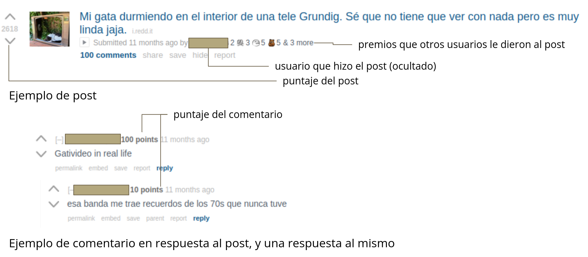
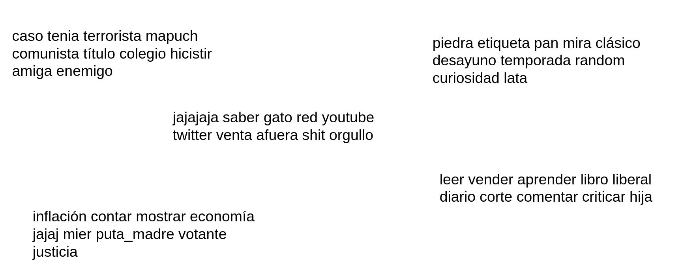
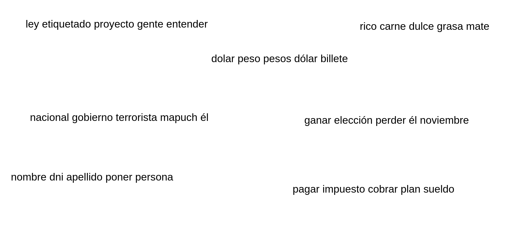
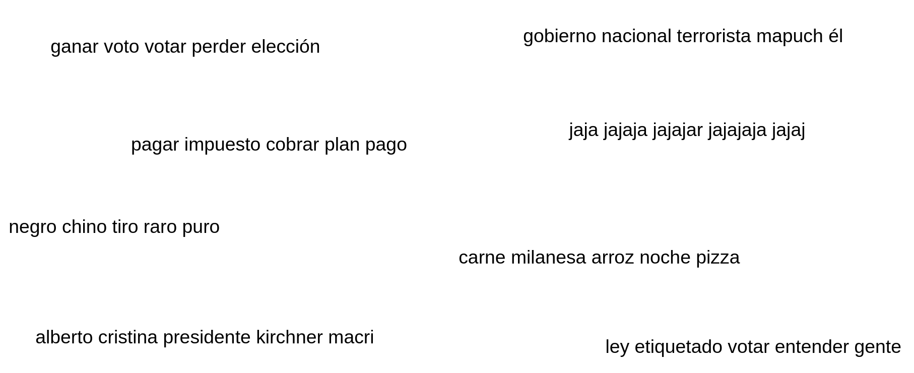

Caracterización de discurso de odio en r/argentina


---

Índice

- [Vistazo rápido](#vistazo-rápido)
  - [Instalación](#instalación)
    - [Instalación con conda](#instalación-con-conda)
    - [Instalación con Docker Compose](#instalación-con-docker-compose)
  - [Flujo de datos generados](#flujo-de-datos-generados)
- [Informe del proyecto](#informe-del-proyecto)
  - [Introducción](#introducción)
    - [Discursos de odio](#discursos-de-odio)
    - [Motivación del trabajo](#motivación-del-trabajo)
    - [reddit](#reddit)
      - [¿Por qué r/argentina?](#por-qué-rargentina)
  - [1. Obtención de datos](#1-obtención-de-datos)
  - [2. Pre-procesamiento](#2-pre-procesamiento)
  - [3. Embeddings](#3-embeddings)
    - [3a. Embeddings con LDA](#3a-embeddings-con-lda)
    - [3b. Embeddings con Word2Vec](#3b-embeddings-con-word2vec)
    - [3c. Embeddings con FastText](#3c-embeddings-con-fasttext)
  - [4. Entrenamiento del detector de odio](#4-entrenamiento-del-detector-de-odio)
  - [5. Aplicación del modelo a los comentarios de reddit](#5-aplicación-del-modelo-a-los-comentarios-de-reddit)
  - [6. Análisis de resultados](#6-análisis-de-resultados)
  - [Conclusiones](#conclusiones)
  - [Trabajo futuro](#trabajo-futuro)
    - [General](#general)
    - [Clustering](#clustering)
    - [Modelo](#modelo)
    - [Información de contexto](#información-de-contexto)
  - [Fuentes consultadas para el trabajo](#fuentes-consultadas-para-el-trabajo)
    - [Discursos de odio](#discursos-de-odio-1)
    - [reddit API](#reddit-api)
    - [Procesamiento de lenguaje natural](#procesamiento-de-lenguaje-natural)
    - [Clustering](#clustering-1)
    - [Competencias](#competencias)
    - [Trabajos relacionados](#trabajos-relacionados)


# Vistazo rápido

El presente repo contiene el código correspondiente al proyecto final de la materia [Minería de datos para texto](https://sites.google.com/unc.edu.ar/textmining2021/), a cargo de Laura Alonso i Alemany.

Objetivo del proyecto: Caracterizar discursos de odio dentro de la comunidad de [reddit Argentina](https://reddit.com/r/argentina). Esto es, detectarlos y encontrar sub-lenguajes de odio en los mismos.

Para realizar esto, se llevó a cabo un proceso consistente en 6 etapas, como se muestra en la siguiente figura:


Cada etapa tiene su correspondiente notebook:

1. Obtención del conjunto de comentarios de a través de la API de Reddit ([notebook](https://github.com/PerseoSoft/redditHateSpeech/blob/main/src/1_pipeline_download_reddit_comments.ipynb)).
   
2. Pre-procesamiento del mismo ([notebook](https://github.com/PerseoSoft/redditHateSpeech/blob/main/src/2_pipeline_preprocessing.ipynb)).

3. Aplicación de embeddings y categorización en clústers (notebook [LDA](https://github.com/PerseoSoft/redditHateSpeech/blob/main/src/3a_pipeline_lda.ipynb) [Word2Vec](https://github.com/PerseoSoft/redditHateSpeech/blob/main/src/3b_pipeline_embedding_word2vec.ipynb) [FastText](https://github.com/PerseoSoft/redditHateSpeech/blob/main/src/3c_pipeline_embedding_fasttext.ipynb)).

4. Entrenamiento de un modelo de detección de odio y extracción de palabras de odio en cada dataset ([notebook](https://github.com/PerseoSoft/redditHateSpeech/blob/main/src/4_detect_hate_speech.ipynb)).
Para realizar el entrenamiento de los modelos, es necesario contar con los datasets respectivos de tres competencias (Hateval, DETOXIS, MeOffendMex) que se desee entrenar.

5. Uso del modelo para predecir los comentarios recolectados ([notebook](https://github.com/PerseoSoft/redditHateSpeech/blob/main/src/5_pipeline_hate_speech.ipynb)).

6. Combinación de dicho modelo con las categorías encontradas para encontrar correlaciones ([notebook](https://github.com/PerseoSoft/redditHateSpeech/blob/main/src/6_pipeline_result.ipynb)).

**Este informe y proyecto estan en proceso 🚧🔨, todavía sujetos a cambios, correcciones, y mejoras**

## Instalación

### Instalación con conda

Instalar Anaconda ([ver aquí](https://docs.anaconda.com/anaconda/install/index.html)) y luego ejecutar:

```bash
#Crear entorno con conda y activarlo
conda env create -f environment.yml
conda activate hateSpeech
#Descarga del Trained pipelines de spaCy
python -m spacy download es_core_news_lg
#Correr Jupyter Lab
jupyter lab --ip=0.0.0.0 --no-browser --allow-root --NotebookApp.token='' --NotebookApp.password=''
```
Ir a [http://localhost:8888](http://localhost:8888) para acceder a la UI de Jupyter.

### Instalación con Docker Compose

Instalar Docker Compose ([ver aquí](https://docs.docker.com/compose/install/)) y luego ejecutar:

```bash
#Construir imagen
docker-compose build
#Correr Jupyter Lab
docker-compose up -d
```

Ir a [http://localhost:8888](http://localhost:8888) para acceder a la UI de Jupyter.

## Flujo de datos generados

Los distintos notebooks forman un pipeline en el cuál cada uno utiliza los datos generados por el anterior. Se listan cada una de las entradas:

1. Obtención de comentarios. 
    - Archivos de entrada: N/A. 
    - Archivo de salida: *docs/reddit_data.csv*: CSV que contiene los comentarios de reddit descargados

2. Pre-procesamiento del dataset.
    - Archivos de entrada: *docs/reddit_data.csv*.
    - Archivos de salida: *docs/preprocessing_reddit_data.csv*: CSV con los comentarios pre-procesados.
   

3. Embeddings y clustering.
    - Archivos de entrada: *docs/preprocessing_reddit_data.csv*.
    - Archivos de salida: 
      - *docs/reddit_data_METODO.csv*, donde *METODO* puede ser 'lda', o 'word2vec', 'fasttext'. Cada uno de estos archivos toma el dataset pre-procesado y le agrega el número de clúster al que pertenecería cada comentario, según su cercanía.
      - *docs/models/MODEL.model*, el modelo entrenado. Puede ser 'word2vec', o 'fasttext'. 
      - *docs/models/MODEL_kmeans.model*, el modelo de k-means entrenado usando los embeddings de *MODEL* (para 'word2vec' y 'fasttext').

    
4. Entrenamiento y selección del modelo.
   - Archivos de entrada: *docs/hateval2019/hateval2019_es_train.csv*, *docs/detoxis_data/train.csv*, y *docs/MeOffendEs/mx-train-data-non-contextual.csv*. Estos archivos requieren la descarga previa manual de cada dataset.
   - Archivos de salida: para cada dataset, se guarda:
     - Palabras de odio de cada modelo: *docs/palabras_odio.csv*.
     - Vectorizador: *docs/models/DATASET_vectorizer.pkl* donde *DATASET* es hateval, detoxis, o meoffendmex.
     - Modelo entrenado: *docs/models/DATASET_INICIALES_MODELO_model.pkl* donde *INICIALES_MODELO* es 'lr', 'rf', o 'nb'.
   - Archivos de salida (de prueba): Predicciones: *docs/test/reddit_DATASET_hate_comments.csv*, uno para cada *DATASET*: 'hateval', 'detoxis', 'meoffendmex'.
   
5. Aplicación del modelo en comentarios de reddit. 
   - Archivos de entrada: *docs/reddit_data_METODO.csv*.
   - Archivos de salida:
     - *docs/reddit_data_hate_speech.csv* - CSV que toma  **TODO**
6. Análisis de resultados.
   - Archivos de entrada: *docs/reddit_data_hate_speech.csv*
   - Archivos de salida: N/A.


# Informe del proyecto

Se muestra a continuación el informe del proyecto, en donde se especifican la motivación y objetivos del trabajo, y los distintos enfoques abordados para realizar la detección de odio.

## Introducción

### Discursos de odio

El discurso de odio es un problema muy relevante en la actualidad, dado su rol en la discriminación de grupos y minorías sociales, y [es considerado como precursor de crímenes de odio, que incluyen al genocido](). **TODO agregar cita**

Hay varias posturas sobre lo que es el discurso de odio, en general se coincide en que es un discurso que:

1. Apunta contra un grupo o individuo, basado en algún aspecto como su orientación sexual, religión, nacionalidad, etc.
2. Busca humillar, discriminar o propagar el odio/hostilidad/intolerancia hacia ese grupo.
3. Tiene una intención deliberada.

Su manifestación en Internet, además:

1. Puede motivar formas de agresión en línea.
2. Permite propagar el discurso de odio con velocidad.
3. Permite que el discurso se mantenga y comparta con facilidad.
4. Facilita la generación de cámaras de eco.
5. Al estar en servidores privados, la aplicación de la ley no siempre es rápida, lo que hace que ciertos actores intenten eludir su control, utilizando el discurso de odio en beneficio de su agenda.

A raíz de la gravedad que significa el problema, muchas plataformas sociales han reconocido el problema, y han optado por prohibirlo en sus términos de uso, pudiendo sus usuarios reportar comentarios que potencialmente contengan este tipo de discursos. **TODO citar**
No obstante, el problema de la propagación de odio permanece...
 **TODO citar**


### Motivación del trabajo

Considerando las consecuencias que puede traer aparejados los discursos de odio, este trabajo se enfoca en la detección de discursos de odio en una comunidad particular de reddit. Los objetivos del mismo son: **1)** detección de comentarios con discurso de odio, y **2)** caracterizar ese discurso de odio en sub-lenguajes de odio.

El presente trabajo se basa en la siguiente hipótesis: "*en una comunidad en donde existen comentarios con discurso de odio, es beneficioso combinar técnicas de aprendizaje supervisado y no supervisado, para realizar la detección de subcomunidades de odio, a partir de modelos que se especializan en distintos grupos de comentarios*".

### reddit

[Reddit](https://www.reddit.com/) es una red social de “comunidades” creadas y moderadas por sus propios usuarios. En cada comunidad sus miembros hacen posts, y cada post puede ser comentado generando debate. Su aspecto distintivo es que cada post o comentario recibe votos, con el objetivo de que aquellos posts o comentarios que más aportan aparezcan encima de los que no. También se pueden premiar a aquellos destacados. 

En la siguiente imagen podemos ver la estructura general de un post en reddit:



En este proyecto, nos centramos en [r/argentina](https://www.reddit.com/r/argentina/), que es una comunidad dedicada a charlar temas referentes a Argentina, que van desde comidas, costumbres, chistes, deporte, política y economía.

#### ¿Por qué r/argentina?

Quisimos hacer nuestro trabajo enfocado en una comunidad Argentina fuera de las redes sociales más comunes (dado que son aquellas más frecuentenemente estudiadas), pero que a la vez tenga el tamaño suficiente como para tener muchos usuarios e interacciones. En ese sentido, r/argentina fue la opción más prominente, ya que la comunidad es muy activa y cuenta con cerca de 350.000 subscriptores (a Noviembre de 2021).

De acuerdo a las reglas de r/argentina (en concreto, la Regla 3), el discurso de odio está prohibido:

>**3. No se permite el racismo, xenofobia u otras expresiones de odio**
>
> No se permite el racismo, xenofobia, ni ninguna otra forma de odio (incluyendo sexismo, homofobia, transfobia, clase social, etc), ni ningún tipo de discriminación o expresiones de odio o lenguaje deshumanizante en general; esto incluye comentarios incitando violencia. Esto también se extiende a grupos. Hacer referencia a enfermedades o discapacidades para insultar a otros no será tolerado. Usuarios que incurran en estas faltas podrán ser baneados permanentemente sin apelación.

No obstante, al ver mensajes de la comunidad para llevar adelante este trabajo, hemos detectado en ciertos casos comentarios con discursos de odio, ej.: manifestando aporofobia, gordofobia, o agresiones contra mujeres, entre otros.

Dado este , la motivación de nuestro trabajo es la de buscar comentarios o mensajes 


## 1. Obtención de datos

[Notebook](/src/1_pipeline_download_reddit_comments.ipynb)

Para la obtención de los datos se utilizó un *wrapper* de la API de reddit, llamado [praw](https://praw.readthedocs.io/en/stable/index.html), a partir del cuál descargamos comentarios de diferentes *post* del *subreddit* argentina, así como las respuestas de los comentarios.
Los comentarios en reddit pueden ser *link* o pueden ser solo textos. Filtramos solamente los comentarios que tengan textos. A la vez solo se consideraron comentarios que tuvieran como mínimo cierta cantidad de caracteres.

De cada comentario que se guardó de reddit, se obtuvieron los siguientes datos:
- *id*: identificador del *post* o comentario. Se guardó por cuestiones de trazabilidad.
- *comment_parent_id*: identificador del comentario al cuál responde el comentario actual, en caso que corresponda. Se guardó por cuestiones de trazabilidad.
- *flair*: categoría del post, asignada por el usuario que lo crea (a partir de una lista brindada por el propio subreddit). En el caso de r/argentina, las categorías incluyen tópicos como "Política", "Economía", "Humor", "Historia" o "Serio".
- *comms_num*: número de respuestas que recibió el comentario.
- *score*: es un puntaje que los usuarios le dieron al comentario.

## 2. Pre-procesamiento

[Notebook](/src/2_pipeline_preprocessing.ipynb)

El pre-procesamiento consistió en:

- Eliminar emojis, urls, comillas, caracteres especiales, puntuaciones.
- Aplicar tokenización: en cada comentario, el token era la palabra.
- Conversión a minúscula.
- Eliminación de stopwords utilizando spaCy.
- Lematización utilizando spaCy.
- Construir bigramas y trigramas.

## 3. Embeddings

Para poder detectar las subcomunidades dentro de reddit, comenzamos utilizando [Latent Dirichlet Allocation](https://en.wikipedia.org/wiki/Latent_Dirichlet_allocation): un método generativo muy utilizado, en el que se asume que cada documento está compuesto por una mezcla de tópicos, y donde cada palabra se relaciona con uno de ellos.

La elección inicial de este modelo se basó en la diversidad de tópicos que el mismo es capaz de detectar.

Al aplicar este modelo, hemos observado que esta **TODO**.


Sin embargo, los resultados que obtuvimos no fueron satisfactorios, ya que a la hora de realizar un análisis de los tópicos identificados por el modelo, encontramos poca cohesión entre los temas.

A raíz de esto, probamos con *word embeddings* donde obtuvimos resultados que captan mucho mejor la semántica de la información. El proceso que llevamos a cabo en word embeddings para obtener las subcomunidades fue:

1. Generar una representación vectorial de los comentarios: se mapearon los comentarios a partir de palabras en vectores numéricos.
2. Aplicamos un algoritmo de *clustering*, particularmente *k-means*, donde las características que se pasaron son los vectores numéricos obtenidos en el paso anterior.

Utilizamos dos técnicas de word embeddings: [Word2Vec](https://en.wikipedia.org/wiki/Word2vec) y [FastText](https://en.wikipedia.org/wiki/FastText).

A continuación, mostramos algunos comentarios que fueron agrupados a través de las diferentes técnicas aplicadas. Un evento particular que sucedió durante la descarga de estos datos en reddit fue el debate de la "[Ley de Promoción de la Alimentación Saludable](https://www.boletinoficial.gob.ar/detalleAviso/primera/252728/20211112)", también conocida como "ley de etiquetado frontal". Vamos a comparar las subcomunidades obtenidos en cada técnica, analizando particularmente la aquellas referidas a este evento.


### 3a. Embeddings con LDA

[Notebook](/src/3a_pipeline_lda.ipynb)

En la siguiente imagen se pueden observar algunos de los tópicos identificados por LDA.



El tópico número 91, **piedra - etiqueta - pan - mira**, incluye comentarios sobre la tratativa de la ley de etiquetado y temas que tienen que ver con la comida en general. Algunos comentarios son:

1. "Me alegro mucho, seguro muy feliz todos por el reencuentro. Igual te recomiendo que no coma directo de la lata, pasale a un platito o comedero. Entiendo que a veces ni te dan tiempo."
2. "Todo mi secundario el desayuno fue un fantoche triple y una lata de coca.  Y sólo gastaba 2. Qué buenos tiempos.""
3. "La manteca no hace mal. Es muy difícil comer exceso de grasas para tu cuerpo en comparación con lo fácil que es atiborrarte con azúcar y carbohidratos. Esos son los verdaderos enemigos"
4. "Y con etiquetas que te dicen cuánta grasa tiene un kilo de bayonesa"
5. "Alta banfest se van a mandar los mods con este thread. Despedite de tu cuenta, maquinola, denunciado"


### 3b. Embeddings con Word2Vec

[Notebook](/src/3b_pipeline_embedding_word2vec.ipynb)

En la siguiente imagen se pueden observar algunas de las subcomunidades identificadas por Word2Vec.



El *cluster* número 94, **ley - etiquetado - proyecto**, incluye comentarios sobre la tratativa de la ley de etiquetado y temas que tienen que ver con las leyes en general. Algunos comentarios son:

1. "Una prueba mas de la ley de oferta y demanda"
2. "Con la nueva ley no le podés regalar leche entera o un alfajor a un comedor, decir comida basura en un país donde el 50\% de los chicos no hacen toda las comidas es lo más clasista que existe."
3. "Recuerden la ley de alquileres.... Fué sancionada con un beso muy fuerte de los K, PRO y demás muchachos..."
4. "No entiendo cómo hay tanta gente en contra de una ley que no te cambia un carajo tu vida. Es la ley más anodina que sacó el Kirchnerismo en toda su historia creo"
5. "Pero hay leyes contra la violencia de genero! Como paso esto!!!1!?"
6. "No existe tal cosa en Argentina. Existe el Estado de Sitio, pero no se asemeja para nada a una ley marcial.. El concepto de ley marcial como tal, desapareció en el 94 con la nueva Constitución."


### 3c. Embeddings con FastText

[Notebook](/src/3c_pipeline_embedding_fasttext.ipynb)

En la siguiente imagen se pueden observar algunas de las subcominidades identificados por FastText.



Como se puede ver en el cluster **jaja - jajaja - jajajar - jajajaja - jajaj**, FastText identifica mejor las alteraciones que pueden suceder dentro de una palabra.

El *cluster* número 113, **ley - etiquetado - votar**, incluye comentarios sobre la tratativa de la ley de etiquetado y temas que tienen que ver con las leyes en general. Algunos comentarios son:

1. "Feriado con fines turísticos. Ley 27.399"
2. "ajajaja como los cagaron a los primeros. como siempre la ley aplica a todos por igual /s"
3. "El sticker en Chile fue durante la transición de la ley. Imagínate tener productos fabricados y tener que cambiar la envoltura a todos para que cumplan la ley"
4. "Gracias gloriosa ley de regulación de alimentos, ahora se que desayunar coca cola con surtidos bagleys esta mal"
5. "Eso y que la ley va a prohibir vender dulces y gaseosas en los colegios, y usar imágenes de famosos en los envases."
6. "Eso está por la ley Micaela no?. Tipo esta clase de capacitaciones no?"
7. "y ahora Lipovetzky reconoce lo de la ley de alquileres"


## 4. Entrenamiento del detector de odio

[Notebook](/src/4_detect_hate_speech.ipynb)

En paralelo a la búsqueda de clústers que agrupen los distintos tópicos, se buscó también, a partir de los datos [pre-procesados anteriormente](#2-pre-procesamiento) el detectar automáticamente comentarios de odio, para poder combinarlos con los [tópicos encontrados](#3-embeddings). Para ello, se recurrió a conjuntos de datos anotados y en castellano, que hayan utilizados para tareas similares. En particular, se optó por los siguientes tres:

**TODO poner las etiquetas que se decidieron usar en cada dataset**

1. HatEval: dataset con cerca de 7000 tweets de usuarios de España, que potencialmente manifiestan discurso de odio contra mujeres o inmigrantes. Este dataset es el más parecido a la tarea que queremos resolver, ya que tiene datos etiquetados que marcan directamente si se trata o no de un tweet con discurso de odio, sea contra un individuo o un grupo. Ejemplo de comentario etiquetado como discurso de odio: **TODO** Ejemplo de comentario sin etiqueta de discurso de odio: **TODO**

2. DETOXIS: dataset con cerca de 3500 comentarios de sitios de noticias/foros españoles, que posiblemente contienen toxicidad. Si bien un mensaje con toxicidad no es necesariamente discurso de odio (y un mensaje con discurso de odio puede tener toxicidad o no), suele estar asociado al mismo. Ejemplo de comentario tóxico sin discurso de odio: **TODO** Ejemplo de comentario tóxico con discurso de odio: **TODO**

3. MeOffendMex: dataset con alrededor de 5000 tweets de usuarios de México, que posiblemente contienen mensajes ofensivos. Al igual que la toxicidad, un mensaje ofensivo no necesariamente está manifestando odio, pero suelen estar asociados. Ejemplo de comentario ofensivo con discurso de odio: **TODO** Ejemplo de comentario ofensivo sin discurso de odio: **TODO**

En cada uno de los mismos, se entrenaron tres modelos de aprendizaje supervisado: *[regresión logística](https://en.wikipedia.org/wiki/Logistic_regression)*, *[naive Bayes](https://en.wikipedia.org/wiki/Naive_Bayes_classifier)* y *[random forest](https://en.wikipedia.org/wiki/Random_forests)*, todos provistos por la librería [scikit-learn](https://scikit-learn.org).

Para realizar el entrenamiento, a cada comentario se le aplicó el vectorizador [CountVectorizer](https://scikit-learn.org/stable/modules/generated/sklearn.feature_extraction.text.CountVectorizer.html), que transformó cada comentario en una matriz *sparse* de forma

**TODO**

$$$$

donde los predictores representan los unigramas, bigramas y trigramas de cada comentario.

Tal matriz, junto con las correspondientes etiquetas de cada comentario, constituyeron la entrada de cada uno de los modelos. Tales modelos funcionaron bastante bien con sus configuraciones básicas, **TODO**, mostrando matrices de confusión sólidas. Especialmente, los que mejor performaron fueron naive Bayes y random forest.

Una vez entrenados, se extrajeron las palabras que posiblemente manifiestan odio en cada dataset, en base al entrenamiento de los modelos de naive Bayes y random forest, de acuerdo a su aporte a la clasificación de las palabras **TODO**.

**TODO agregar matrices de confusión, y comentar un poco los criterios tomados, especialmente respecto a los falsos positivos**


La salida del detector de odio se puede ver en el archivo **TODO**.


## 5. Aplicación del modelo a los comentarios de reddit

[Notebook](/src/5_pipeline_hate_speech.ipynb)

Una vez teniendo los modelos entrenados, el siguiente paso consistió en aplicarlos en los comentarios recolectados de reddit.

Al aplicar los modelos entrenados en los comentarios, lo primero que se observó es la cantidad de falsos positivos detectados como comentario de odio.

En particular, el dataset cuyo mejor rendimiento observamos detectando comentarios en reddit fue MeOffendEs **TODO**. A partir de esto, se guardaron los resultados y **TODO**.

Los modelos entrenados detectaron .


## 6. Análisis de resultados

[Notebook](/src/6_pipeline_result.ipynb)

Estando generados los clusters, los modelos entrenados, las palabras de odio y los resultados, se procede a hacer un análisis de los resultados obtenidos.


## Conclusiones

- .

## Trabajo futuro

### General

- Tomando el enfoque de este trabajo como base, buscar caracterizar el discurso de odio en otras comunidades de foros populares argentinos, tales como [Taringa!](https://www.taringa.net/), [r/republicaargentina](https://www.reddit.com/r/RepublicaArgentina/), [r/dankargentina](https://www.reddit.com/r/dankargentina/), o comunidades argentinas en Twitter.

### Clustering

- Usar coeficientes de silueta para determinar el número óptimo de clústers.

### Modelo

- Realizar un etiquetado en diferentes comentarios de r/argentina que pertenezcan a ciertos clusters que potencialmente contengan odio, y entrenar un modelo a partir de ellos, para poder mejorar la detección de comentarios de odio.
- Realizar optimización de híper-parámetros.

### Información de contexto

- Incorporar info de la comunidad, para ver qué tan de acuerdo estuvieron los usuarios con los comentarios.
- Incorporar el contexto del comentario padre, especialmente si se lo está respondiendo. Esto es dado que un mensaje puede no ser un mensaje de odio por sí sólo, pero sí lo es al observar el comentario al que se contesta.
- Considerar dejar de alguna forma los emojis, ya que también pueden representar una forma de manifestar odio.
- Incorporar más los tags al análisis, como por ejemplo: “\[Serio\]”.


## Fuentes consultadas para el trabajo

### Discursos de odio

- https://en.wikipedia.org/wiki/Hate_speech
- https://www.rightsforpeace.org/hate-speech
- https://www.un.org/en/genocideprevention/hate-speech-strategy.shtml
- https://fsi.stanford.edu/news/reddit-hate-speech
- https://variety.com/2020/digital/news/reddit-bans-hate-speech-groups-removes-2000-subreddits-donald-trump-1234692898
- https://www.reddithelp.com/hc/en-us/articles/360045715951-Promoting-Hate-Based-on-Identity-or-Vulnerability

### reddit API

- https://www.jcchouinard.com/reddit-api/


### Procesamiento de lenguaje natural

- Foundations of Statistical Natural Language Processing - Manning & Schütze (1999)
- https://spacy.io
- https://radimrehurek.com/gensim/
- https://www.nltk.org
- https://www.baeldung.com/cs/ml-word2vec-topic-modeling
- https://www.kdnuggets.com/2018/04/robust-word2vec-models-gensim.html
- https://adrian-rdz.github.io/NLP_word2vec/
- https://towardsdatascience.com/applying-machine-learning-to-classify-an-unsupervised-text-document-e7bb6265f52
- https://dylancastillo.co/nlp-snippets-cluster-documents-using-word2vec/
- https://www.roelpeters.be/calculating-mutual-information-in-python/

### Clustering

- https://towardsdatascience.com/k-means-clustering-8e1e64c1561c
- https://paperperweek.wordpress.com/2018/04/09/best-ways-to-cluster-word2vec/
- https://ai.intelligentonlinetools.com/ml/k-means-clustering-example-word2vec/
- https://medium.com/@rohithramesh1991/unsupervised-text-clustering-using-natural-language-processing-nlp-1a8bc18b048d
- https://xplordat.com/2018/12/14/want-to-cluster-text-try-custom-word-embeddings/
- https://towardsdatascience.com/clustering-with-more-than-two-features-try-this-to-explain-your-findings-b053007d680a


### Competencias

- HatEval (SemEval 2019): https://competitions.codalab.org/competitions/19935
- DETOXIS (IberLEF 2021): https://detoxisiberlef.wixsite.com/website/corpus
- MeOffendEs (IberLEF 2021): https://competitions.codalab.org/competitions/28679


### Trabajos relacionados

- https://github.com/jfreddypuentes/spanlp
- https://medium.com/ml2vec/using-word2vec-to-analyze-reddit-comments-28945d8cee57
- https://www.kaggle.com/szymonjanowski/internet-articles-data-with-users-engagement
- https://towardsdatascience.com/religion-on-twitter-5f7b84062304
- https://becominghuman.ai/detecting-gender-based-hate-speech-in-spanish-with-natural-language-processing-cdbba6ec2f8b
- https://www.learndatasci.com/tutorials/sentiment-analysis-reddit-headlines-pythons-nltk/
